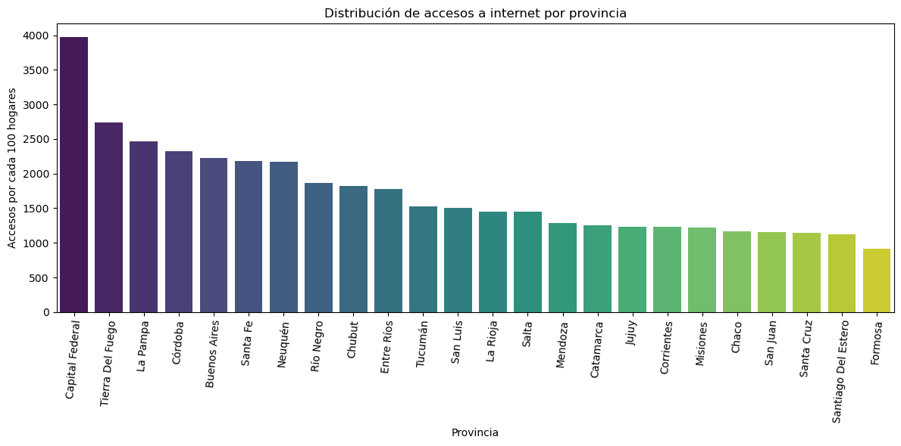

<h1 align='center'>
 <b>PROYECTO INDIVIDUAL Nº2</b>
</h1>

# <h1 align="center">**`Acceso a internet en la Argentina`**</h1>

¡Bienvenidos a mi segundo proyecto individual de la etapa de labs! En esta ocasión, debo hacer un trabajo situándome en el rol de un ***Data Analyst***.

> ### ****Introducción****

Las telecomunicaciones son el conjunto de tecnologías y sistemas diseñados para transmitir y recibir información a distancia. Desde los albores de la historia, el ser humano ha buscado formas de comunicarse más allá de las barreras físicas, pero fue en el siglo XIX cuando las telecomunicaciones dieron su gran salto con la invención del telégrafo y el teléfono.

Sin embargo, el verdadero punto de inflexión llegó con la aparición de Internet, que revolucionó por completo el mundo de las telecomunicaciones. Gracias a esta red global, ahora podemos compartir mensajes, imágenes, vídeos e incluso voz en tiempo real, sin importar la ubicación geográfica.

Pero las telecomunicaciones no solo se limitan a la transmisión de datos. También abarcan otras áreas vitales como la telefonía móvil, las redes de televisión, la radiodifusión y la comunicación vía satélite. Estas tecnologías han acortado distancias, conectando a personas, empresas e incluso naciones, permitiendo el intercambio de información de manera rápida y eficiente.

En resumen, las telecomunicaciones son el cimiento de nuestra sociedad hiperconectada, permitiéndonos superar las barreras físicas y comunicarnos de forma instantánea a escala global. Son el motor impulsor de la revolución digital que ha transformado nuestra forma de vivir, trabajar y relacionarnos, y continúan evolucionando para llevarnos hacia un futuro cada vez más interconectado.

>### ****Tarea encomendada****
En este caso particular, una empresa prestadora de servicios de telecomunicaciones me encarga la realización de un **análisis** completo que permita reconocer el comportamiento de este sector a nivel nacional. 

# `EDA` (Exploratory Data Analysis)

Antes de inciar con el **análsis exploratorio de datos** comenzamos exportando los datos abiertos de [ENACOM](https://datosabiertos.enacom.gob.ar/dashboards/20000/acceso-a-internet/)

De todos los dataset he considerado hacer un proceso de ETL para darle formato a los datos y luego unirlos para simplificar y no tener que trabajar con cada tabla de forma individual. Esa fue la forma más cómoda que me salió en ese momento para abordar con el análisis.

De los 8 dataset que he descargado disponibles en ENACOM pude simplificarlo en dos datasets <strong>*acceso_internet_1.csv*</strong> y <strong>*acceso_internet_2.csv*</strong> con los que posteriormente trabajé para hacer un analisis exploratorio. Lo pueden encontrar en el repositorio con el archivo notebook.

Las librerías que utilicé para este analisis fueron

- ***Pandas***
- ***Numpy***
- ***Matplotlib.pyplot***
- ***Seaborn***

## *Empezamos a explorar datos para obtener información*

En primer lugar importamos el dataset <strong>*'acceso_internet_1'*</strong> que contiene información de las provincias, las distintas velocidades de internet, el año y otros datos que fueron de utilidad para empezar a descubrir y analizar información.

Me pareció interesante mostrar la ***evolución en el tiempo de los accesos a internet por cada 100 hogares en Argentina*** utlizando un gráfico de líneas.

Es interesante observar que el gráfico de líneas muestra una tendencia alcista en la cantidad de accesos a Internet por cada 100 hogares a lo largo del tiempo. Esto nos puede estar diciendo que, en general, ha habido un crecimiento en la disponibilidad de acceso a Internet en Argentina. Es un indicio positivo de que se ha logrado expandir el acceso a Internet y brindar servicios de comunicación a una mayor cantidad de hogares.
Sin embargo, es importante considerar que este análisis se basa en la cantidad de accesos por cada 100 hogares, por lo que no proporciona información sobre la calidad o la velocidad de las conexiones. 

Ahora nos metemos un poco más en profundidad. Utilizo un gráfico de barras para mostrar  ***Accesos y velocidades en Argentina***. Con este gráfico podemos ver cántos son y que tan rápido se navega en las provincias de Argentina.

Podemos concluir que la mayoría de las conexiones de banda ancha fija en Argentina se encuentran en el rango de velocidad de '+ 1 Mbps - 6 Mbps' con el 44.91% del total, seguidas de las velocidades de '+ 30 Mbps' aunque todavía existe una proporción significativa de conexiones con porcentajes más bajas.

Me pareció interesante analizar la <strong>distribución de los accesos a internet por provincia (Accesos por cada 100 hogares)</strong>. Para ello me pareció adecuado hacerlo con un gráfico de barras.

 
Si observamos, en el extremo izquierdo del gráfico, se encuentra "Capital Federal" con la mayor cantidad de accesos a internet por cada 100 hogares. Esto indica que es la provincia con la mayor proporción de hogares que tienen acceso a internet en comparación con las demás provincias.
Por otro lado, en el extremo derecho del gráfico, encontramos "Formosa" con la menor cantidad de accesos a internet por cada 100 hogares. Esto sugiere que Formosa tiene una proporción más baja de hogares con acceso a internet en comparación con otras provincias.
Estas observaciones resaltan la disparidad existente en la distribución de accesos a internet en las distintas provincias de Argentina. Capital Federal, como el centro urbano principal del país, tiene una mayor infraestructura y acceso a servicios de telecomunicaciones en comparación con provincias menos desarrolladas o áreas rurales, como Formosa.
Esto indica que existe una posible brecha digital entre las provincias más desarrolladas y las menos desarrolladas en términos de acceso a internet. Identificar estas disparidades es importante para tomar medidas y mejorar la conectividad en áreas con menor acceso.
Es importante tener en cuenta que esta visualización muestra la distribución relativa de accesos a internet por provincia, no el número absoluto de accesos. Por lo tanto, la comparación entre provincias debe considerarse en función de la proporción de accesos a internet por cada 100 hogares en lugar de los números exactos.
Para abordar estas diferencias y mejorar el servicio, sería bueno realizar una expansión de insfraestrucura, alianzas estratégicas con proveedores locales en las provincias que tienen menos accesos.

Ahora anelicemos <strong> velocidad de internet predominante en Formosa y Capital Federal</strong>.

Esta diferencia en el panorama de velocidades de navegación entre Formosa y Capital Federal puede ser atribuible a diversos factores, como la infraestructura de telecomunicaciones disponible en cada provincia, el acceso a tecnologías de conexión de alta velocidad y las preferencias de los proveedores de servicios de Internet en cada área.

Sin embargo, si vemos la <strong>evolución en el tiempo de las velocidades de conexión en Formosa</strong> podemos notar un crecimiento con notable en infrastrucura para brindar una mayor velocidad en este caso '+30 Mbps'

En este caso tomé la velocidad de conexión que predomina en el en la provincia '+ 1 Mbps - 6 Mbps' en comparación la de '+30 Mbps' que es la vista al futuro. 
A pesar de que en Formosa la conexión '+30 Mbps' tiene un porcentaje muy bajo con respecto a las otras provincias con mayor infraestrucura como por ejemplo 'Capital Federal', a partir del segundo trimestre del 2019 va en aumento. Lo que quiere decir que se está invirtiendo en insfraestructura para cubrir la demanda de los usuarios. 

Enfoquemos el análisis un poco mas con el tipo de <strong>Tecnologías de acceso en Argentina</strong>

En téminos del tipo de conexión podemos observar que Cablemodem con un 49.97% del total por tecnología de acceso, podemos afirmar que se establece como la tecnología mas importante y con mayor proyección hasta el 20222, seguido de  la tecnología ADSL con un 36.85%, seguido la Fibra Óptica con 8.96%, la tecnología Wireless con el 2.73% y Otros con el 1.49%.

Vemos la evolución des estas tecnologías en el tiempo:

Con este gráfico vemos que, a pesar de que 'Cablemódem' se sobrepone de forma ascendente con respecto a las otras conexiones, la conexión de Fibra óptica ha tenido un impulso ascendente imortante a partir del año 2018. Podemos concluir que hubo un mayor desarrollo de infraestructura, así como despliegue de redes de fibra óptica para soportar el ancho de banda que se demanda en la actualidad.

# `Dashboard`

Para el <strong>dashboard</strong> utilizamos la herramienta <strong>POWER BI</strong>. 

- <strong>Descripción:</strong> Antes de comenzar, me gustaría establecer los objetivos de nuestro análisis. Es decir, lo que me gustaría lograr al explorar el acceso a internet en Argentina. La intención es comprender la infraestructura y la calidad del acceso a Internet en el país: Me parece interesante investigar y analizar la infraestructura de banda ancha en Argentina, incluyendo la cobertura geográfica, la velocidad de conexión y la estabilidad del servicio. Esto me permitiría comprender cómo la calidad del acceso a Internet podría afectar la vida cotidiana de los argentinos y su capacidad para acceder a información, recursos y oportunidades en línea. Investigar la brecha digital: para explorar cómo se distribuye el acceso a Internet en Argentina y si existe una brecha digital entre distintas regiones, áreas urbanas y rurales, grupos socioeconómicos y generaciones. Comprender estas disparidades podría ayudar a identificar posibles desafíos y oportunidades para cerrar la brecha digital y garantizar un acceso equitativo a la información y la tecnología.

En este proyecto, se han analizado los conjuntos de datos sobre el acceso a Internet en Argentina. Se han realizado exploraciones descriptivas y se han creado visualizaciones interactivas utilizando Power BI. El dashboard proporciona información detallada sobre las velocidades de conexión, la distribución de banda ancha fija y otros aspectos relevantes en diferentes provincias del país.

* <strong>`KPI` Crecimiento porcentual de accesos a Internet en Argentina:</strong> nos permitirá medir el crecimiento anual de la disponibilidad de conexiones a Internet en el país. Este KPI nos dará una visión clara de cómo se ha expandido el acceso a Internet en Argentina a lo largo del tiempo y permitirá evaluar el éxito de las políticas y estrategias implementadas para mejorar la infraestructura de comunicación.

* <strong>`KPI` Penetración porcentual de acceso a internet por cada 100 hogares</strong>: Nos permite medir y comparar la adopción de Internet en diferentes áreas geográficas, brindando información valiosa sobre el nivel de conectividad y la inclusión digital en una región específica o a nivel nacional.

* <strong>`KPI` Velocidad promedio de navegación:</strong> Este KPI es relevante para evaluar la calidad de las conexiones de Internet en una región determinada y para identificar posibles áreas de mejora en la infraestructura de telecomunicaciones. Además, puede ser utilizado para comparar la competitividad y el avance tecnológico de diferentes regiones en términos de conectividad de Internet.

En <strong>conclusión,</strong> el análisis realizado revela que el acceso a Internet en Argentina ha experimentado un crecimiento significativo en los últimos años. Sin embargo, persisten desafíos en términos de brechas digitales entre provincias y la necesidad de aumentar la velocidad y la disponibilidad de banda ancha en algunas regiones.

El proyecto destaca la importancia de monitorear constantemente el acceso a Internet y promover políticas y acciones que impulsen la inclusión digital y mejoren la infraestructura de telecomunicaciones en todo el país.

